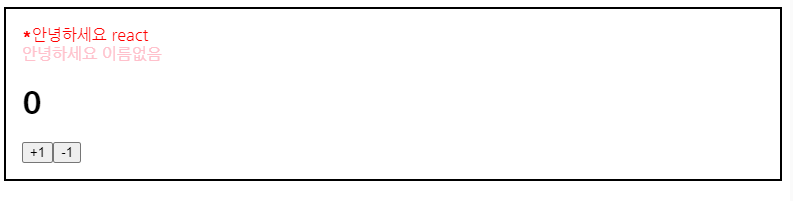

# React Chapter 01

_출처  :_ [_https://react.vlpt.us/basic/07-useState.html_](https://react.vlpt.us/basic/07-useState.html)\_\_

\_\_

```text
import React, { useState } from 'react';

function Counter() {
  const [number, setNumber] = useState(0);

  const onIncrease = () => {
    setNumber(prevNumber => prevNumber + 1);
  }

  const onDecrease = () => {
    setNumber(prevNumber => prevNumber - 1);
  }

  return (
    <div>
      <h1>{number}</h1>
      <button onClick={onIncrease}>+1</button>
      <button onClick={onDecrease}>-1</button>
    </div>
  );
}

export default Counter;

//Counter.js
```



따라하면서 구현하는데 이해가 되지 않는 부분이 있어서 기록하러옴.

```text
function Counter() {
  const [number, setNumber] = useState(0);

  const onIncrease = () => {
    setNumber(prevNumber => prevNumber + 1);
  }

  const onDecrease = () => {
    setNumber(prevNumber => prevNumber - 1);
  }
```

바로 이 부분인데, 

```text
const [number, setNumber] = useState(0);
//변수,setter 설정 
//useState로 초기화
```


```text
  const onIncrease = () => {
    setNumber(prevNumber => prevNumber + 1);
  }

  const onDecrease = () => {
    setNumber(prevNumber => prevNumber - 1);
  }
  
  //setNumber에 들어가면 해당 함수가 가지고 있는 prevNumber의 값에서 1을 증가시켜라
  
```

참조문서 : [https://oyg0420.tistory.com/entry/Reactjs-%EB%A6%AC%EC%95%A1%ED%8A%B8-state%EC%99%80-props](https://oyg0420.tistory.com/entry/Reactjs-%EB%A6%AC%EC%95%A1%ED%8A%B8-state%EC%99%80-props)

```text
this.state = {
    name : 'bong',
    age : 25 ,
    job : 'developer',
};
```

이러한 state 객체를 변경하기 위한 함수가 setState\(\)인데 이 함수는 비동기로 작동한다. 즉,이 함수를 써서 업데이트를 해도 즉각 반영되는게 아니라는 소리,,

setState\(updater,\[,callback\]\) updater:\(state,props\)=&gt;stateChange

updater에 담겨있는 state와 prop은 최신값, 이것을 이용해 상태 업데이트. 두번째 인수 callback은 setState의 실행이 완료되고 컴포넌트가 렌더링 뒤에 실행될 함수임 =&gt; 이말은 즉슨, 콜백을 이용해 상태의 값들을 변경할수있다는 뜻,,? 같음.


이건, 텍스트 박스에 입력한 값을 실시간? 으로 값: 저부분에 표시해주는 페이지이다.

```text
import React,{useState} from "react";
//useState 불러오

function InputSample() {
  const [text,setText] = useState('');
  // 변수와 setter 둘다 None? Null 로 초기화
  const onChange = (e) => {
    setText(e.target.value);
    //여기선 event의 e란다,, 처음에 error 인줄;
    //event => target => value 해당 value 를 설정함 
    //즉 이 함수를 가지고 있는 컴포넌트에서 일어나는 밸류를 텍스트로 가진다
  };
  const onReset = () => {
    setText('');
  };

  return (
    <div>
      <input onChange ={onChange} value = {text} />
      //입력창에 입력한 value가 text가 되고 그 값은
      <button onClick = {onReset}> 초기화 </button>
      <div>
      //여기에 나온다!
        <b>값: {text} </b>
      </div>
    </div>
  );
  
}

export default InputSample;

```

그리고 조금 이해안가서 다시봤던 코드!

```text
import React, { useState } from "react";

function InputSample() {
  const [inputs, setInput] = useState({
    name: "",
    nickname: ""
  });

  const { name, nickname } = inputs;

  const onChange = (e) => {
    const { value, name } = e.target;
    //이 부분!
    //처음에는 nickname 과 name 을 받는 변수인 줄 알았는데 그게 아니라,
    //한 컴포넌트의 이름과 value 를 한쌍으로 받는 것이였다!
    setInput({
      ...inputs,
      [name]: value
    });
  };
  const onReset = () => {
    setInput({
      name: "",
      nickname: ""
    });
  };

  return (
    <div>
      <input name="name" placeholder="이름" onChange={onChange} value={name} />
      <input
        name="nickname"
        placeholder="닉네임"
        onChange={onChange}
        value={nickname}
      />
      <button onClick={onReset}>초기화</button>
      <div>
        <b>값: </b>
        {name} , {nickname}
      </div>
    </div>
  );
}

export default InputSample;

```


이걸 보면, name 값의 고유 name은 name 이고,  nickname의 고유 name 은 nickname 이다,

{name : onyoo} {nickname: 온유} 이렇게 사용자가 건드리는 컴포넌트 하나에 대한 함수였던 것 이다..

